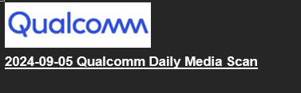
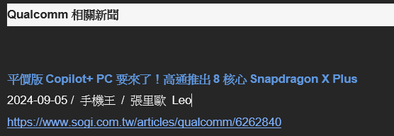
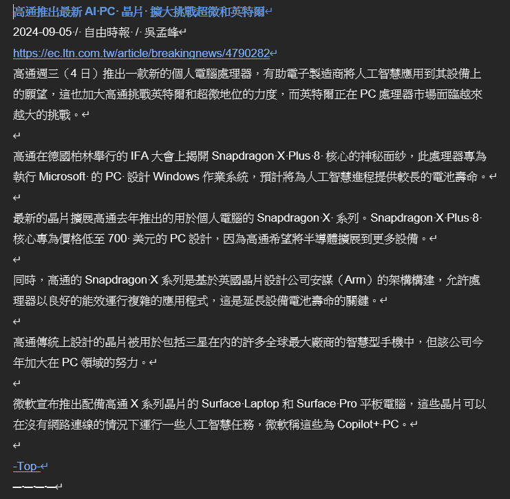

# 貼DMS
## 無AutoDMS之流程
1. DMS LINE群 打開全部新聞連結
2. 一則一則複製新聞，依 [類別](#類別) 分類新聞，並依 [每則新聞格式](#每則新聞格式) 貼到Word檔
3. 依 [內容與順序](#內容與順序) 排序
4. 若LINE群有新連結，重複以上

## 有AutoDMS之流程
1. 打開 AutoDMS擴充元件 之 Dashboard
2. 只要傳給DMS Import LINE bot 的連結都會依 [每則新聞格式](#每則新聞格式) <ins>**自動傳至 Dashboard**</ins>
3. 如果不用DMS Import LINE bot，也可以利用 Manual Import鍵 手動新增
4. 我已盡力利用關鍵字分類和依新增前後順序排序，但絕對不會100%準確，所以還是請依 [內容與順序](#內容與順序) 排序

::: warning 聲明
類別和順序是我花最久的時間處理的面向，可惜的是我還沒找到100%解決辦法，以後我處理好會推出後端更新
:::

## 檔名&標題
::: info 註:
AutoDMS會在輸出時自動填入，有AutoDMS不須做這步
:::
- 檔名和最一開始的標題，要改成當天日期, e.g.檔名: 2024-09-05 Qualcomm DMS.docx，Word檔裡最一開始的標題如下:

## 每則新聞格式
::: info 註:
AutoDMS編輯時不需要擔心空格和字體，輸出時會幫你弄好，只需要看每欄是不是正確資訊
:::
1. **標題**
  - 該類別第一則，新聞標題和類別標題中間空兩行

  - 新聞前面的小標式標題(例如《科技》，要刪掉)
  - 標題中英文夾雜的話，中間的空格要去掉
  - 標題的全形空格要改半形，標點符號要改成全形 (%例外) 
  - QCT字體
2. **日期、媒體名稱、記者**
  - 2024-07-11 / xxx / xxx（斜線跟文字間有一個半形空格）
  - 比較細的媒體名稱可以去Glossary反查

  - 字體: 中文新細明體、英文Arial、字體大小10
  - 媒體名稱固定
3. **連結**
4. **內文**
   - 文章有小標的話，前後都要空一行 
   - 段落之要有間隔(2次Enter鍵) 
   - 利用Word尋找與取代，尋找全形空格，取代為半形空格
   - 中時的有3種(通常能從標題看出來)：
     - 中國時報：中國時報（通常有紙本報導）
     - 中時／中時新聞網：中時新聞網 
     - 時報資訊：時報資訊 

5. TOP: 從別的檔案複製，TOP之前要空一行

**Example:**

## 內容與順序
::: info 註:
AutoDMS目前只會依新增前後順序排序以及關鍵字分類，<ins>**請務必手動編輯**</ins>
:::
1. 選作今日摘要的新聞，要放該類別第一則，如選到Intel的新聞，我們會把Intel的新聞先擺前面，之後才放其他新聞
2. 依[類別順序](#類別順序)排序，同一新聞事件(發表會，法說會)放在一起
3. 在不違背類別順序下，再依媒體順序 : 
     - 電子
     - 工商
     - 經濟
     - 自由
     - 聯合
     - 中國 
     - 電視台(ETtoday、三立)
     - 網媒(中央社、太報)
     - 科技媒體(Mashdigi、Cool3c、手機王)
     - 財經媒體 (MoneyDJ)
4. 排日期(時間)順序，有些新聞可能同一家媒體昨天和今天都有報導，較新的會排前面 

## 類別順序

#### Qualcomm
無特殊排序
#### Mediatek
無特殊排序
### 智慧型手機/消費性電子產品
- 順序
  1. 搭載高通產品/技術的智慧裝置
  2. 其他廠商的新聞（例如重點關注公司：蘋果、華為、三星、Google）
  3. 其他公司手機處理器的新聞（如：三星Exynos、華為Kirin、Google Tensor）
  4. 研調機構、智慧裝置的研究報告
  5. 促銷的新聞（例：降價榜單） 
- 智慧裝置順序
  1. 手機
  2. PC
  3. 其他裝置（平板、XR裝置、手錶、汽車等）   
   
### 其他業界重要訊息 
- PC處理器是放這
- 順序: 
  1. 晶圓/製程（台積電、三星等）
  2. 重點關注廠商的動態（微軟、英特爾等） 
  3. 活動/論壇（例：其他廠商發的Computex新聞稿）
  4. 產業分析
  5. 其他 

- 廠商順序
  1. 台積電
  2. 三星
  3. 英特爾
  4. 微軟
  5. 華碩
  6. 宏達電
  7. 宏碁
  8. 半導體產業趨勢 
 